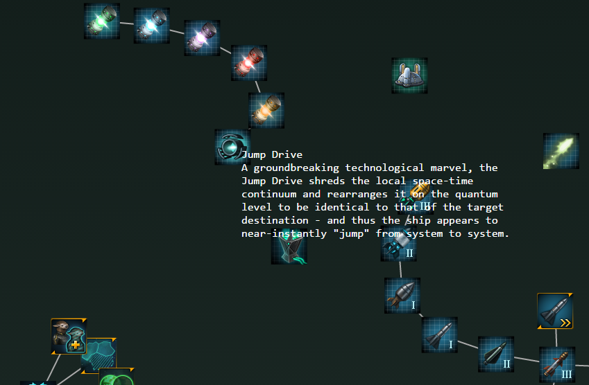

# Stellaris Data Visualization

Paradox's excelent game Stellaris setting data file viaualization project.

## DDS to PNG

Stellaris use non-compressed `.dds` file save image. I forked python package `pilgrim` and add 
function to do it.

https://github.com/yiyuezhuo/pilgrim

then call `dds_to_png.py` as:

```python
dds_to_png_map(input_path, output_path)
```

## Technology Dependency Force Graph

Created by `d3.js`.



### Update by yourself!

I am not always follow the update process of Stellaris. If you enjoy the work and want to update it to newest version.
You can do it by following steps:

0. You should install Python 3.x and Node.js (Well, Node is strange in this case since python play a more flexible role compare to
the confusing mixing, but when I write the project firstly, I try to practice Node so the ugly separation done.).

1. Install python package `pilgrim`, sadly although I have pushed the update to pip keeper and he merge my push. But the 
pip version seems old and not working in python3. You should install the newest version 
from Github(https://github.com/yiyuezhuo/pilgrim).

2. Run `python dds_to_png_cli.py root_path root_output_path`.
(You can find help description by running `python dds_to_png_cli --help`.). 
You will get hundreds png files that will be used in the final graph. 

3. Modifing `config.json`. the attribution `stellaris-path` is your Stellaris installation root path.
You almost certainly need to modify the attribution. 
And the attribution `localFile` is localization file that you want to use, the English is default.

4. Running `node jsonp.js` that take `config.json` generate `jsonpData.js` that is a JSONP data file will be used
in final graph.

